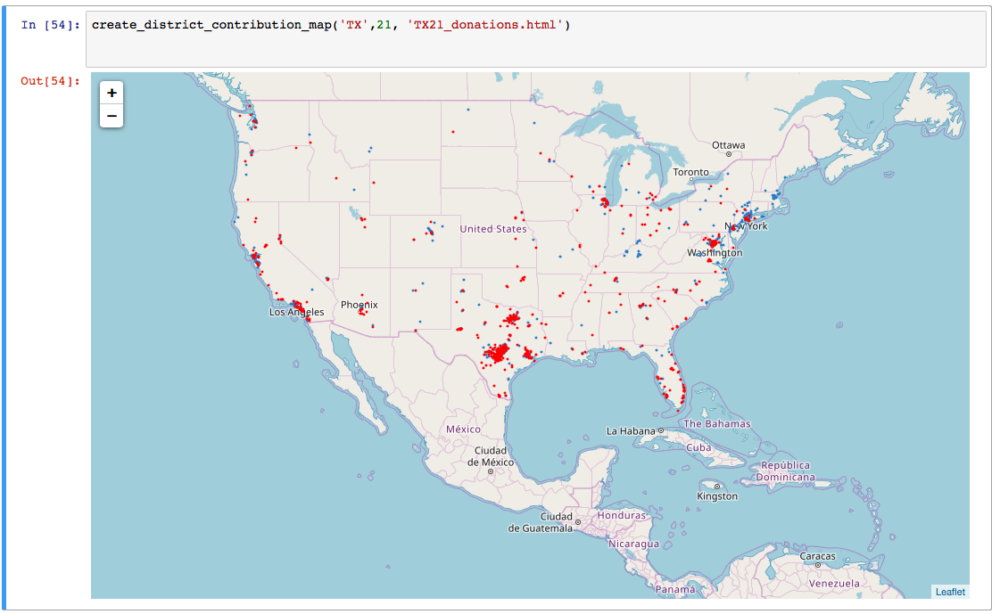
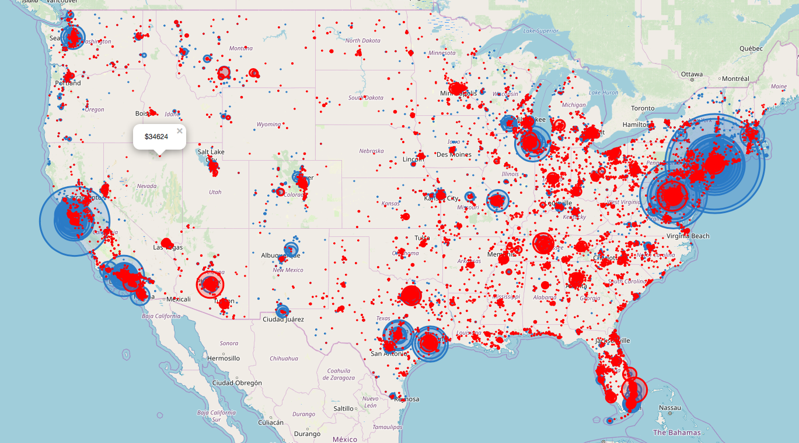

# midterms_2018
### Analysis of the 2018 Midterm Election Contributions by Individuals

This notebook downloads individual contribution data from the FEC site.  The size of the raw data is over 4Gb.  For this reason the raw data is not provided and the notebook begins with the downloading of data from the fec.gov site.

The candidate data is downloaded from:

<https://www.fec.gov/files/bulk-downloads/2018/cn18.zip>

The data for contributions to candidate commitees is from:

<https://www.fec.gov/files/bulk-downloads/2018/indiv18.zip>

### The descriptions of the data fields can be found at:

<https://classic.fec.gov/finance/disclosure/metadata/DataDictionaryCandidateMaster.shtml>
<https://www.fec.gov/campaign-finance-data/contributions-individuals-file-description>

I have provided code to download, unzip and merge the candidate data with the individual contributions data.

The processing of this data is resource intensive due to the size of the files.  This can be worked around by eliminating fields prior to reading into Pandas.  The download and merging of the files should need to be performed only once since the notebook creates a smaller file called `transactions.csv` which can be loaded into Pandas in future sessions.

The notebook trys to answer a few question:

* *What were the total number of contributions to House, Senate and Presidential Campaigns respectively?*
 
* *What were the total number of contributions to each party?*
 
* *What were the total amounts of contributions to each party?*
* *What are the summary statistics for contributions to each party?*
* *How many contributions are above this limit of $2700?*
* *What do the distributions of contributions and total contributions by date look like?*
* *Who are the biggest donors by name and occupation to each party?*
* *Who are the biggest donors to Texas house races?*
* *Where geographically are donations coming from?*
* *Can we predict which party a contribution is going to based off of zip code?*
* *Can we predict which party a contribution is goint to based off of the reported occupation of the donor?*

Additionaly the notebook is set up to generate heat maps of where contributions are comming from for each congressional race.  The below line will create `TX21_donations.html` a heat map of where contributons are coming from for the Texas 21 house race.  This is a Leaflet map created with Folium.

One map of all money for all races is also generated.  This can be seen below.  This file is large and some web browsers may have trouble with it.

